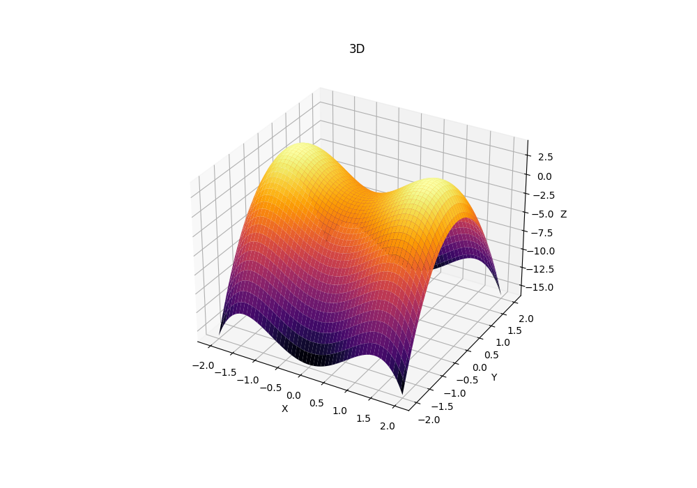
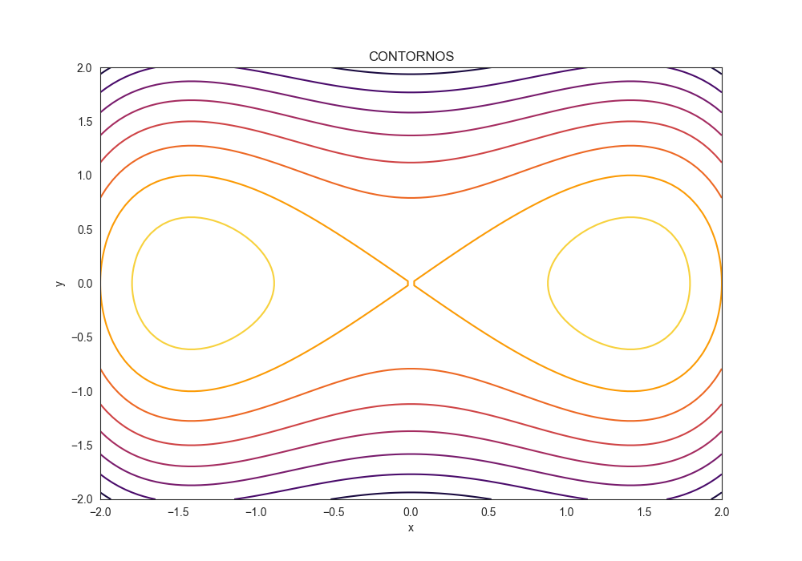
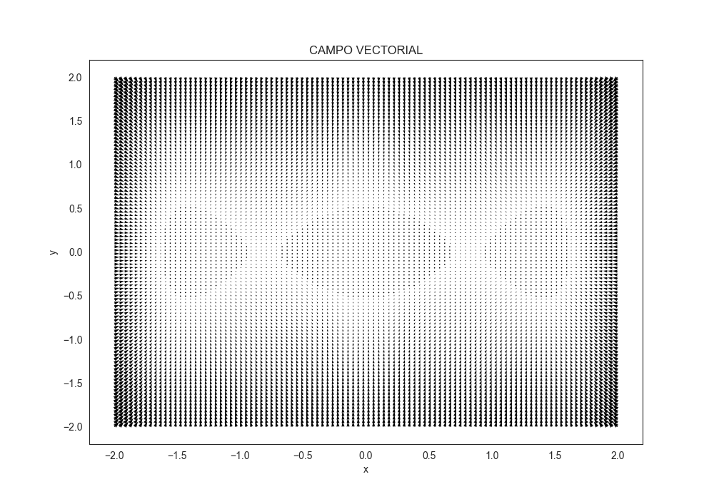

# Graficar Función y Gradiente

Este repositorio contiene un script en Python que permite graficar una función tridimensional y su gradiente en dos dimensiones utilizando la biblioteca Matplotlib.

## Funcionalidades

El script proporciona las siguientes funcionalidades:

- Graficación de la función tridimensional en un espacio 3D.
- Generación de contornos de la función en un plano bidimensional.
- Visualización del campo vectorial del gradiente en un plano bidimensional.

## Ejemplos de Gráficas

A continuación se muestran ejemplos de las gráficas generadas en el script:

### Gráfica en 3D


### Gráfica de Contornos


### Campo Vectorial



## Requisitos

El script requiere los siguientes paquetes de Python:

- NumPy
- Matplotlib
- Seaborn

Puedes instalar estos paquetes usando pip:

-pip install numpy, matplotlib, seaborn


## Uso

Para usar el script, simplemente ejecuta el archivo `plot_function_and_gradient.py`. Asegúrate de tener instalados los paquetes requeridos mencionados anteriormente.

```bash
python plot_function_and_gradient.py
```
Esto generará las gráficas de la función y su gradiente en tres diferentes representaciones: 3D, contornos y campo vectorial.
